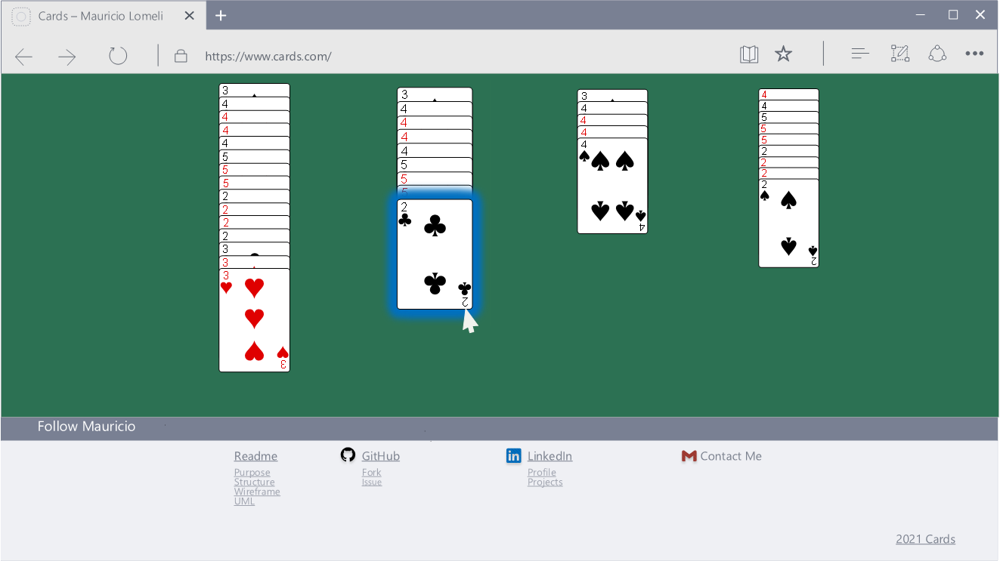
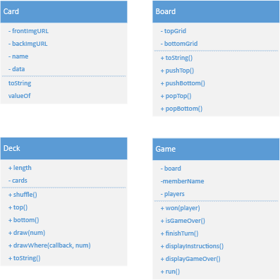

# Cards &nbsp; [](https://mjlomeli.github.io/cards/)

## License
[](#license)
[](https://github.com/mjlomeli/cards/issues)

Released under [MIT](/LICENSE) by [@Mauricio](https://github.com/mjlomeli).

**Email** : [Mauricio](mailto:mauricio.jr.lomeli@gmail.com)


## Browser Compatibility
[](https://www.google.com/chrome/)

[](https://www.mozilla.org/)

[](https://www.opera.com/)

[](https://www.microsoft.com/)

[](https://www.apple.com/safari/)


<br>


# Welcome to MoveItThere!

## Purpose

This is a recreation of the Solitaire card game entirely out of Javascript and HTML5. Its primary purpose is as a proof
of concept.

## Rules
&nbsp;&nbsp;&nbsp;&nbsp;&nbsp;&nbsp;&nbsp;&nbsp;You may drag any top card faced up to any of the piles but maintain the sequence of descending value and alternating color. An empty spot in the Tableau may be filled with a king. If you cannot move any cards from the Tableau, 1 card may be drawn from the Stock pile and placed in the Talon.<p>

&nbsp;&nbsp;&nbsp;&nbsp;&nbsp;&nbsp;&nbsp;&nbsp;When foundations have been filled in ascending order (Ace to King with the same colors), the game is won. If no more moves can be made and the Foundations is incomplete, the game is lost.


### In Cards, users will be able to:

* Drag and drop.
* Draw from a deck.
* Restart a game after finishing.

### In addition, this project will include:

* A comprehensive README
* Instructional guide

### Technologies, Libraries, APIs

* Used a mp3 to make sounds of the cards.
* Made a version of the Cartesian Product from Python's documentation.

## Structure

Split the objects into 5 modules:

## 1. Sound
#### Creates the sound in the background using mp3 audio.
The program is compliant with Google's user interaction requirements. To enable 
the sound the program is always muted at startup until the user clicks to unmute.

```javascript
let sound = new Sound(audioPath);
sound.play();
```

#### Compliance Section
In compliance with Chrome's autoplay policy. More can be found: https://developer.chrome.com/blog/autoplay/#webaudio
```javascript
function play(){
     let promise = this.sound.play()
     if (promise !== undefined){
         promise.then(_=> {
             // it worked
         }).catch(error => {
             // Required to catch by Google's compliance.
             console.warn("Press the unmute button on the top left to hear audio.");
         })
     }
}
```

## 2. Card
#### Makes the Card elements on the DOM.
- Has a shape
- Front face image
- Back face image
- Flippable
- Id
- Draggable

```javascript
let card = new Card(frontImagePath, backImagePath);

// Flipping the card
card.flip()
```

## 3. Deck
#### The data structure for each pile.
- Is a data structure of Cards.
- Shuffles
- Draws card(s)

```javascript
let deck = new Deck();

// Drawing n cards
let n = 5;
let fiveCards = deck.draw(5)

// Drawing with callback
let fiveSpades = deck.draw(5, (card) => card.suit === 'spades');

// Shuffling
deck.shuffle();
```

##  4. Board
#### The datastructures for indexing each data.
- Links cards to positions on a grid.
- Background
- Datastructures are hash optimized.
```javascript
let board = new Board();
await board.buildBoard();

// Get the Stock stack
let stock = board.deckIndex['stock'];

// Get the Talon elements
let talon = board.elementIndex['talon'];
```

## 5. Game
#### Maintains all the logic in the interaction.
- Player takes turns to solve the game.
- Is all the logic for making the rules of the game.
```javascript
let game = new Game();
await game.buildGame();
document.body.appendChild(game.rootelement);
```

## 6. Utilities
#### Tools which greatly contributed in the development.
- Cartesian product
- Immutable matrix multiplication.
- Checks system for compatible environments (e.g. Web or NodeJs).
- Debugging tools.
- Proxy tools for more customizations.
- Directory and file operations.

```javascript
//Cartesian product
product(['ace', 1], ['hearts', 'spades'])

//>> [['ace', 'hearts'], ['ace', ['spades'], [1, 'hearts'], [1, 'spades']]
```

```javascript
//Proxy: traps the 'in' operator
let Handler = {
   has(target, key) {
      let found = Reflect.has(...arguments);
      return found || target.foundations.includes(key);
   }
}
let board = new Proxy(Board, Handler);

console.log('ace' in board)
//>> true
```


## 7. Tutorial
- Display instructions for the player to learn how to play.
- Pops up quotes.

## Goals

#### Day 1: _Wireframe & UML_

* _Design a wireframe concept and upload design details._




#### Day 2: _Skeleton Setup_

- Create the skeleton of each structure
- Test on command line

#### Day 3: _Canvas Skeleton_

- Create the objects.

#### Day 4: _Apply Objects_

- Bind the objects to events.

#### Day 5: _Debug_


#### Day 6-7: _Improve Project_
- Improve the game with additional visuals.

## Checklist

### Live Project

- [x] Includes links to your Github and LinkedIn.

- [x] Landing page/modal with obvious, clear instructions.

- [x] Interactivity of some kind.

- [x] Well styled, clean frontend.

- [x] If it has music, the option to mute or stop it.

### Production README

- [x] Link to live version.

- [x] Instructions on how to play/interact with the project.

- [x] List of technologies / libraries.

- [x] Technical implementation details with (good-looking) code snippets.

- [x] To-dos / future features.

- [X] No .DS_Store files / debuggers / console.logs.

- [X] Organized file structure, with /src and /dist directories.

### Contributors

<table>
  <tr>
      <td id="mauricio" align="center">
         <a href="https://github.com/mjlomeli">
         <br />
         <sub><b>Mauricio Lomeli</b></sub></a><br />
         <label>Code</label>
      </td>
      <td id="charis" align="center">
         <a href="https://github.com/Eruanne2">
         <br />
         <sub><b>Charis Ginn</b></sub></a><br />
         <label>Mentor</label>
      </td>
      <td id="paulo" align="center">
         <a href="https://www.linkedin.com/in/paulo-bocanegra">
         <br />
         <sub><b>Paulo Bocanegra</b></sub></a><br />
         <label>Debugging</label>
      </td>
      <td id="mike" align="center">
         <a href="https://github.com/mwmadsen67">
         <br />
         <sub><b>Mike Madsen</b></sub></a><br />
         <label>Debugging</label>
      </td>
      <td id="lee" align="center">
         <a href="https://github.com/lyhourlay1">
         <br />
         <sub><b>Lyhour(Lee) Lay</b></sub></a><br />
         <label>Debugging</label>
      </td>
   </tr>
</table>
